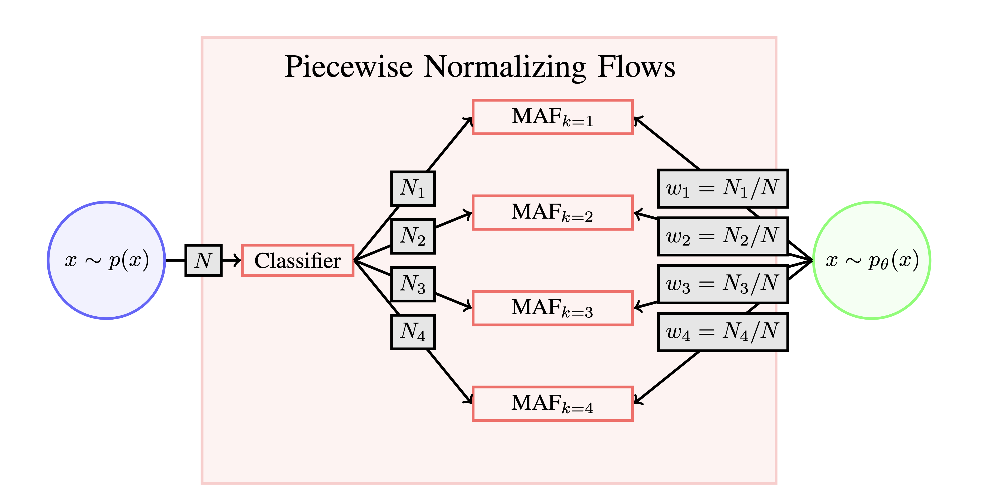

# Piecewise Noramlizing Flows

The repository includes the code for the experiments performed in and plots
shown in the paper 
[Piecewise Normalizing Flows](https://arxiv.org/abs/2305.02930).

The code currently relies on the branch 
[clustering_implementation](https://github.com/htjb/margarine/tree/clustering_implementation)
in the repository [*margarine*](https://github.com/htjb/margarine).

The piecewise normalizing flows (NFs) are designed to improve the accuracy of
normalizing flows when learning multi-modal distributions. NFs typically
struggle with multi-modal distributions because the topology of the base
distribution, usually a standard normal, is so different from the
topology of the target distribution. There have been a number of
attempts to improve accuracy by modifying the base distribution either
through the use of Gaussian Mixture Models or through learned rejection
sampling e.g. [Stimper et al. 2022](https://proceedings.mlr.press/v151/stimper22a).

Our approach is to classify samples from the target distribution into
clusters using a K-means clustering algorithm and train a Masked
Autoregressive Flow (MAF) on each cluster. We can then draw samples from the different
MAFs based on the initial split of samples between clusters and calculate
the log-probability of sample by summing the probability on each MAF. The figure
below shows the approach.

In the paper we compare the accuracy of our approach to that of Stimper et al. 2022
with a series of toy examples and find that the piecewise normalizing flows are
more accurate. We show the benchmarks below.

## Figure 1

Figure 1 is a simple illustration of the piecewise flows in action
in comparison with a normal Masked Autoregressive Flow.