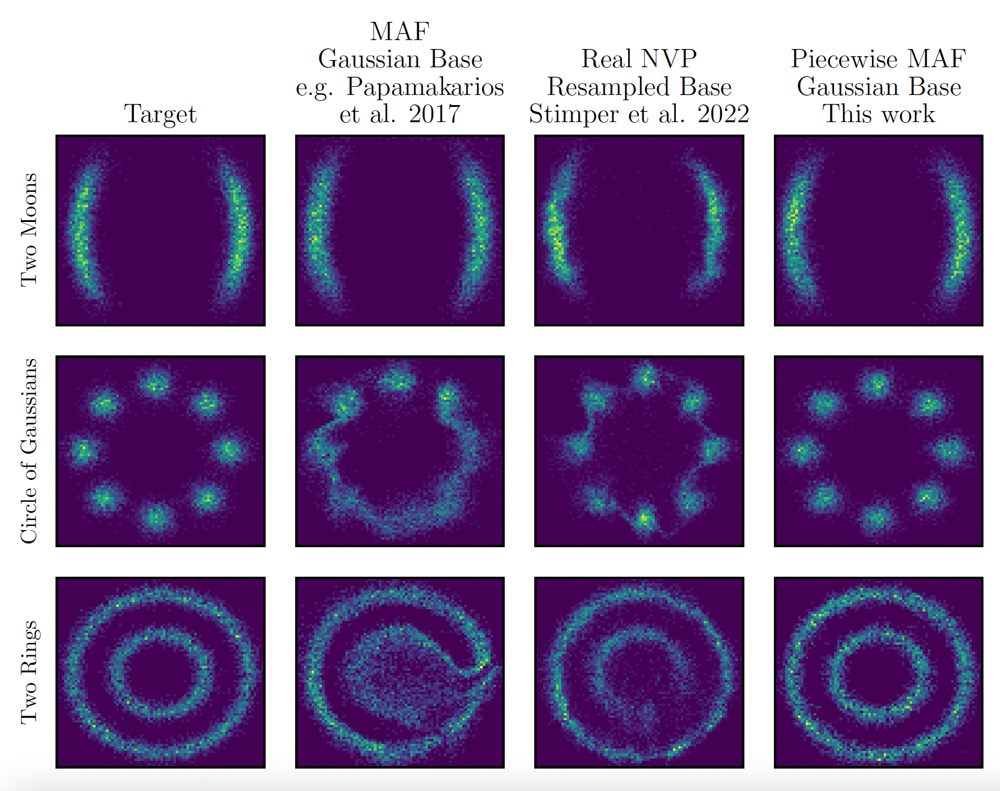

# Piecewise Noramlizing Flows

The repository includes the code for the experiments performed in and plots
shown in the paper 
[Piecewise Normalizing Flows](https://arxiv.org/abs/2305.02930).

The piecewise normalising flows are implemented with
[*margarine*](https://github.com/htjb/margarine). The following code
demonstrates how to initialise, train and sample from a piecewise normalising
flow

```python
from margarine.maf import MAF

# here I am assuming your samples are in a numpy array theta and there is a corresponding set of weights
# setting clustering=True sets this up as a piecewise normalising flow
flow = MAF(theta, weights, clustering=True)

# train the maf
flow.train(5000, early_stop=True)

# margarine samples from the clusters as described in the paper
samples = flow.sample(5000)

# and calcualtes probabilities too
log_prob = flow.log_prob(samples)
```

The piecewise normalizing flows (NFs) are designed to improve the accuracy of
normalizing flows when learning multi-modal distributions. NFs typically
struggle with multi-modal distributions because the topology of the base
distribution, usually a standard normal, is so different from the
topology of the target distribution. There have been a number of
attempts to improve accuracy by modifying the base distribution either
through the use of Gaussian Mixture Models or through learned rejection
sampling e.g. [Stimper et al. 2022](https://proceedings.mlr.press/v151/stimper22a).

Our approach is to classify samples from the target distribution into
clusters using a K-means clustering algorithm and train a Masked
Autoregressive Flow (MAF) on each cluster. We can then draw samples from the different
MAFs based on the initial split of samples between clusters and calculate
the log-probability of sample by summing the probability on each MAF. The figure
below shows the approach.


In the paper we compare the accuracy of our approach to that of Stimper et al. 2022
with a series of toy examples and find that the piecewise normalizing flows are
more accurate. We show the benchmarks below.



## Figure 1

Figure 1 is a simple illustration of the piecewise flows in action
in comparison with a normal Masked Autoregressive Flow.

## Figure 2

Figure 2 shows how we determine the numnber of clusters for each distribution
based on the silouette score using one of the benchmarks as an example.

## Benchmarks

Uses code from Stimper's [normflows](https://github.com/VincentStimper/normalizing-flows)
package, Stimper's [Resampled Base Flows work](https://github.com/VincentStimper/resampled-base-flows)
and the package [*margarine*](https://github.com/htjb/margarine) 
to demonstrate the relative performance of each model explored in the paper.

The `benchmarks.py` code generates samples from a series of target distributions
from `target_dists_stimper.py`, fits the samples with a simple MAF, a realNVP
flow with a resampled base distribution and the piecewise MAF, calculates
the KL divergence between the flow and the target distribution and an associated
error. It then plots the distributions as in the example above. This is repeated
10 times to attempt to account for uncertainty in the caluclation of the KL
divergence. `benchmark_duplicates/` contains the trained flows used in the paper.

## Citation

If you use the piecewise approach in your work please cite the paper

**Bibtex**
```
@ARTICLE{2023arXiv230502930B,
       author = {{Bevins}, Harry and {Handley}, Will},
        title = "{Piecewise Normalizing Flows}",
      journal = {arXiv e-prints},
     keywords = {Statistics - Machine Learning, Computer Science - Machine Learning},
         year = 2023,
        month = may,
          eid = {arXiv:2305.02930},
        pages = {arXiv:2305.02930},
archivePrefix = {arXiv},
       eprint = {2305.02930},
 primaryClass = {stat.ML},
       adsurl = {https://ui.adsabs.harvard.edu/abs/2023arXiv230502930B},
      adsnote = {Provided by the SAO/NASA Astrophysics Data System}
}
```

## Requirements

The code requires;

- [margarine](https://github.com/htjb/margarine)
- [numpy](https://numpy.org)
- [matplotlib](https://matplotlib.org)
- [tensorflow](https://www.tensorflow.org)
- [tensorflow_probability](https://www.tensorflow.org/probability)
- [scipy](https://scipy.org)
- [sklearn](https://scikit-learn.org/stable/)
- [pytorch](https://pytorch.org)
- [normflows](https://github.com/VincentStimper/normalizing-flows)
- [anesthetic](https://github.com/handley-lab/anesthetic)
- [tqdm](https://github.com/tqdm/tqdm)
- [larsflows](https://github.com/VincentStimper/resampled-base-flows)